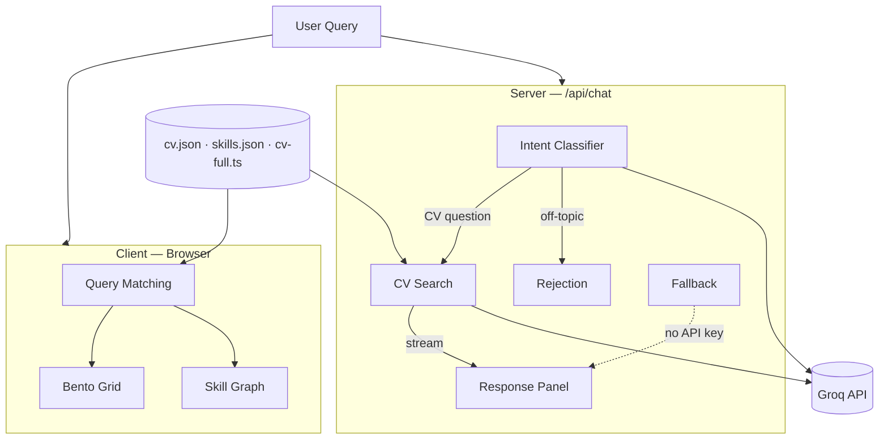

# Vladyslav Avilov — AI-Powered Portfolio

An interactive portfolio site that lets visitors explore career history, skills, and projects through natural-language search backed by LLM streaming responses. Built with Next.js 15 (App Router), React 19, and the Vercel AI SDK.

## Features

- **Natural-language search** — type a question like _"Show me agentic AI work"_ and the UI highlights matching projects, activates skill graph nodes, and streams an LLM-generated answer in a slide-out response panel.
- **Intent classification** — a two-stage AI pipeline first classifies intent (CV-related vs. off-topic) using `openai/gpt-oss-120b` on Groq, then answers with `llama-3.3-70b-versatile`. Off-topic queries are politely rejected.
- **Client-side query matching** — keyword-based scoring runs instantly in the browser to reorder and highlight projects before the streamed response arrives.
- **Interactive skill graph** — a force-directed graph (`d3-force` / `react-force-graph-2d`) visualises skills across five categories (AI & ML, Languages, Frontend, Backend, DevOps) with click-to-filter and hover interactions.
- **Bento grid experience cards** — featured and supporting project cards reorder in real time based on search relevance, with highlight/dim transitions via Framer Motion.
- **Thought-trace animation** — a step-by-step progress indicator (_Analyzing query → Matching skills → Filtering projects → Preparing response_) provides visual feedback during streaming.
- **Graceful fallback** — when no API key is configured, a deterministic fallback response is generated from matched skills and project titles so the site remains fully functional.
- **Dark theme** — ships with a dark colour scheme using CSS custom properties and Tailwind CSS 4.
- **Accessibility** — skip-to-content link, semantic landmarks, ARIA labels, and `prefers-reduced-motion` support.

## Tech Stack

| Layer | Technologies |
|---|---|
| Framework | Next.js 15, React 19, TypeScript |
| Styling | Tailwind CSS 4, `tw-animate-css`, CSS custom properties |
| UI primitives | shadcn/ui (badge, button, card, input) |
| Animation | Framer Motion 12 |
| Data viz | `d3-force`, `react-force-graph-2d` |
| AI | Vercel AI SDK (`ai`), `@ai-sdk/groq` |
| Icons | Lucide React |
| Fonts | Geist Sans & Geist Mono via `next/font` |

## Project Structure

```
app/
  page.tsx                  # Home — renders PortfolioExperience
  layout.tsx                # Root layout, metadata, dark theme
  api/chat/route.ts         # POST endpoint — intent classification + CV search streaming
  globals.css               # Tailwind base, theme tokens, utility classes
components/
  shared/                   # Feature components
    portfolio-experience    # Top-level orchestrator (search, grid, skill web, panels)
    agentic-hero            # Hero section with search bar and prompt chips
    bento-grid              # Responsive project card grid
    featured-project-card   # Large project card for flagship roles
    project-card            # Compact project card for supporting roles
    interactive-skill-web   # Force-directed skill graph with filtering
    skill-graph-canvas      # Canvas renderer for the graph
    response-panel          # Slide-out panel for streamed AI responses
    thought-trace           # Step-by-step progress indicator
    experience-search       # Search input with streaming indicator
    prompt-chips            # Suggested query chips
    active-filter-chip      # Active skill filter badge
    proof-links-panel       # External proof links (LinkedIn, GitHub)
    contact-cta             # Contact call-to-action footer
    status-header           # Top status bar
  ui/                       # Reusable primitives (badge, button, card, input)
  layout/                   # Layout wrappers (section-shell)
data/
  cv.json                   # Structured project data (titles, stacks, metrics, skills)
  cv-full.ts                # Full-text CV used as LLM context
  skills.json               # Skill graph nodes and links
  site.ts                   # Proof links and contact CTA content
lib/
  ai.ts                     # System prompts and prompt builders
  query-matching.ts         # Client-side keyword matching and scoring
  fallback-responses.ts     # Deterministic fallback when AI is unavailable
  portfolio.ts              # Data loading with runtime invariant checks
  types.ts                  # Shared TypeScript types
  utils.ts                  # General utilities (cn, etc.)
hooks/
  use-resize-observer.ts    # Responsive resize hook for the skill graph
docs/
  requirements.md           # Project requirements and acceptance criteria
  ADRs/                     # Architectural decision records
```

## Getting Started

### Prerequisites

- Node.js 18+
- A [Groq](https://console.groq.com/) API key (optional — the site works without it using fallback responses)

### Setup

```bash
# Install dependencies
npm install

# Copy the example env file and add your Groq key
cp .env.example .env
```

Edit `.env` and set `GROQ_API_KEY` to your key. Leave it empty to run with deterministic fallbacks only.

### Development

```bash
npm run dev
```

Open [http://localhost:3000](http://localhost:3000).

### Production Build

```bash
npm run build
npm start
```

## Data

CV content lives in `data/cv.json` (structured projects) and `data/cv-full.ts` (plain-text CV fed to the LLM). The skill graph is defined in `data/skills.json` with nodes categorised into five groups and links expressing relationships between skills. Runtime invariants in `lib/portfolio.ts` validate that every project's `activeSkills` reference valid graph nodes.

## How Search Works

1. The user types a query or clicks a prompt chip.
2. `matchProjects()` runs client-side: it tokenises the query, scores every project by keyword overlap and skill match weight, and returns ranked project IDs plus matched skills.
3. The UI immediately reorders the bento grid and activates the corresponding skill graph filter.
4. In parallel, a `POST /api/chat` request fires. The API classifies intent, then streams a concise LLM answer grounded in the full CV text. If the API is unavailable, the pre-computed fallback response is shown instead.

## Architecture



## ADRs

Architectural decision records are in [`docs/ADRs/`](docs/ADRs/).

| # | Decision | Status |
|---|----------|--------|
| [001](docs/ADRs/001-nextjs-app-router.md) | Next.js 15 with App Router | Accepted |
| [002](docs/ADRs/002-groq-llm-provider.md) | Groq as LLM inference provider | Accepted |
| [003](docs/ADRs/003-tailwind-shadcn.md) | Tailwind CSS 4 + shadcn/ui | Accepted |
| [004](docs/ADRs/004-vercel-ai-sdk.md) | Vercel AI SDK for streaming | Accepted |
| [005](docs/ADRs/005-force-graph-visualisation.md) | d3-force + react-force-graph-2d for skill graph | Accepted |
| [006](docs/ADRs/006-framer-motion.md) | Framer Motion for layout animation | Accepted |
